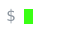

 

I like to build projects.

 

| project | stack | what it is |
| :-- | :-- | :-- |
| [**github-skyline-3d**](https://github.com/HatefulRock/github-skyline-3d) | TypeScript | renders a year of contributions as a 3D skyline (the one below) |
| [**FlexTrack**](https://github.com/HatefulRock/FlexTrack) | React Native · Expo | local-first fitness tracker: per-set logging, all on-device, track the evolution of your workouts |
| [**Blueprint**](https://blueprint-learn.com) | React  · Python | language learning website |

· a few more repos are still private, happy to walk through them.

 

real contribution data, rendered in 3D · <a href="https://github.com/HatefulRock/github-skyline-3d">source + interactive version</a>

 

 

